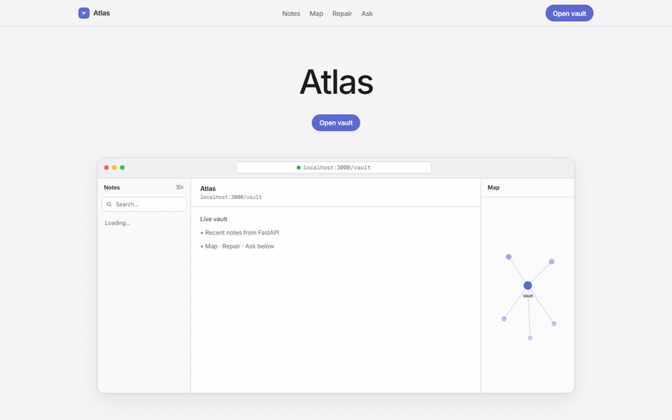

# Second Brain Knowledge Engine

Explore your Obsidian notes as a 3D map and ask questions about them, with everything running on your own machine.

[](https://github.com/Bryancruzcb/second-brain-tools/actions/workflows/ci.yml)

Nothing leaves the machine. There are no cloud calls and no hosted AI: retrieval is local ChromaDB plus an in-memory BM25 index, generation is Qwen through Ollama, and both LLM clients are constructed against localhost. The graph, note reader, and health tools all keep working when Ollama is off — only the Qwen features need it.

## The hard part: parsing a cloud-synced vault

The vault lives in OneDrive, so half the problem is the filesystem lying to you.

Parallelising the file reads is the obvious first move and it's wrong — it saturates OneDrive's File Provider daemon and the scan dies with `os error 60`. So the Rust core reads files **sequentially on purpose** and parallelises only the CPU-bound work, fanning wikilink and tag extraction across cores with Rayon ([`core/src/main.rs:173`](core/src/main.rs#L173) and [`:194`](core/src/main.rs#L194)).

The second trap is files that aren't really there. OneDrive leaves placeholders — metadata on disk, content not downloaded — and touching one triggers a blocking download or an error. `is_dataless_file()` detects them without reading: `FILE_ATTRIBUTE_OFFLINE` / `FILE_ATTRIBUTE_RECALL_ON_DATA_ACCESS` on Windows, `SF_DATALESS` on macOS. Those notes are served read-only from the last index instead of failing the request.

Both of these came from running it against my own vault and watching it stall.



*Above: opening the 3D graph, finding a note through graph search, and asking Qwen about it — the answer is generated locally and cites the source notes it used.*

## What it includes

- **Workspace overview** with vault totals, recent notes, daily rediscovery, structural health, and separate refresh/index controls.
- **3D knowledge graph** with deterministic layout, explicit and semantic links, tag filters, search, camera focus, keyboard navigation, and context selection.
- **Note reader and editor** with Markdown rendering, save states, Qwen co-writing, Obsidian deep links, and an indexed read-only fallback for OneDrive placeholders.
- **Ask Qwen** with multi-note context chips, local retrieval, source links, clear loading/error states, and no hosted AI dependency.
- **Command search** with `⌘K`, semantic results, direct note opening, and a quick path from a search phrase into Qwen.
- **Vault tools** for creating notes, saving web clips, refreshing graph/health data, and rebuilding the AI search index.

## Retrieval quality

Retrieval is scored against a private set of 40 real questions about my own
vault, 32 about notes and 8 about chat transcripts: each case asks whether
the note that actually answers the question is among the chunks handed to
Qwen. The harness is public (`backend/eval/`); the dataset stays local
because it's my personal notes.

The August sequence, hit-rate@4 and MRR@4 on the index of that day:

| Change | hit-rate@4 | MRR@4 |
|---|---|---|
| Baseline: MiniLM embeddings, 500-word chunks, vector-only | 70.0% | 0.496 |
| + Heading-aware chunking (split at markdown headings, code-fence aware) | 70.0% | 0.529 |
| + Hybrid retrieval (BM25 keyword leg + reciprocal rank fusion) | 70.0% | 0.592 |
| + Cross-encoder reranker (ms-marco-MiniLM over the fused top-20) | 80.0% | 0.694 |
| + bge-small-en-v1.5 embeddings, with the BGE query instruction | 80.0% | 0.713 |

Each change was aimed at a measured diagnosis, not added on faith. The
first three rows improved ranking while hit-rate sat still: the misses
were sibling-note confusion (right folder, wrong note), which is exactly
what a cross-encoder fixes, and it converted four of those twelve misses.
The embedding swap then targeted the misses that never reached the fused
top-20 at all, pulled one of those five into the pool, and the harness
caught something subtler: bge *without* its query instruction was a
hit-rate regression (77.5%), *with* it a modest win, so the instruction
shipped as the default.

### Re-measured 2026-09-04

By September the same pipeline scored 77.5% / 0.715 on the same
questions. The corpus had grown underneath it (4,321 chunks, 4,215 of them
chat transcripts) and nothing was watching. Two changes, both measured on
one frozen copy of that index:

| Configuration | hit-rate@4 | hit-rate@6 | MRR@4 |
|---|---|---|---|
| Shipped in August: depth 20, 4 chunks | 77.5% | | 0.715 |
| Depth 30 | 80.0% | 80.0% | 0.717 |
| Depth 30, one chunk per note, 6 chunks served (shipped now) | 80.0% | 82.5% | 0.717 |

Fetching 30 candidates per leg instead of 20 lifts pool recall from 87.5%
to 90.0% and converts one miss; going deeper than 30 costs reranker time
and converts nothing (still 80.0% at depth 80). Showing more chunks did not
help by itself: at depth 30 the served hit-rate was 80.0% at 4, 6 and 8
chunks with the same eight misses, because the extra slots went to further
chunks of the same long, generic notes (one interview-prep note appears in
32 of the 40 candidate pools). Capping each note to one chunk turns the
extra slots into extra notes: 82.5% at 6 chunks and 85.0% at 8.
Six ships because six chunks plus a full conversation history still fit
the 8,192-token context; eight needs `OLLAMA_NUM_CTX=16384`.

Reranking 30 candidates with `cross-encoder/ms-marco-MiniLM-L-6-v2` takes
about 1.5 s median on this laptop's CPU (Core Ultra 7 155H); an earlier
version of this section claimed ~210 ms, which no longer reproduces.

One honesty note on precision: rebuilding the index and re-running the
eval moves the numbers by about one case (±2.5 points hit-rate, ±0.03
MRR) because Chroma's approximate-nearest-neighbor index is
non-deterministic at build time; within a single build the eval is
exactly reproducible. Treat the tables as a trend, not tenths.

Every retrieval knob is an env var: `EMBEDDING_MODEL`,
`EMBEDDING_QUERY_PREFIX`, `RERANKER_MODEL` (set to `off` on slow CPUs),
`HYBRID_DEPTH`, `RERANK_DEPTH`, `TOP_K`, `MAX_CHUNKS_PER_NOTE` (0 disables
the cap), `OLLAMA_MODEL`. Changing the embedding model requires a full
re-embed: `python scripts/rebuild_rag_index.py --full` from `backend/`.

*The August rows were measured 2026-08-05/06; the September table on
2026-09-04. Two cases accept either of two related notes; the rest label
a single expected note.*

Score it against your own vault:

```bash
cd backend
cp eval/dataset.example.jsonl eval/dataset.jsonl   # then write real cases
python -m eval.run_eval
```

The published number is kept honest by a committed scorecard,
`backend/eval/scorecard.json`: the metrics, the retrieval settings they were
measured under, and a census of the index, with no questions and no note
paths. A test compares it with the shipped settings and with the block below,
so changing a retrieval setting without re-running the eval fails CI. The
nightly archive job re-scores the private set after each incremental index
update and prints a drift warning when the hit-rate falls by two cases or more.

<!-- eval-scorecard:start -->
Recorded 2026-09-04 over 40 cases against an index of 4,321 chunks from 304 files (63 notes, 241 chat transcripts): `BAAI/bge-small-en-v1.5` embeddings with its query instruction, each leg fetched to depth 30, the fused top 30 reranked by `cross-encoder/ms-marco-MiniLM-L-6-v2`, 6 chunks served, at most 1 per note.

| Chunks shown | Hit-rate | MRR |
|---|---|---|
| 4 | 80.0% | 0.717 |
| 6 (shipped) | 82.5% | 0.722 |
<!-- eval-scorecard:end -->

## Architecture

1. **`core` — Rust**  
   Walks the vault and parses Markdown, wikilinks, tags, and structure. Reads sequentially to survive OneDrive; parses in parallel with Rayon.
2. **`backend` — FastAPI / Python**  
   Serves graph and note APIs, stores embeddings in ChromaDB, and queries local Qwen through Ollama.
3. **`frontend` — Next.js / React Three Fiber**  
   Provides the desktop workspace, responsive layouts, Markdown tools, chat, and WebGL graph.
4. **`clipper` — Chrome extension**  
   Saves selected web content into the vault inbox.
5. **`scripts` — archive pipeline**  
   Exports AI chat transcripts (Claude Code, Codex, Gemini) into the vault as Markdown, regenerates the per-source chat indexes, runs a vault health report, updates the vector index incrementally, and backs up the vault. Designed to run unattended on a schedule.

## Prerequisites

- Node.js 18+
- Python 3.10+
- Rust and Cargo
- [Ollama](https://ollama.com/download) for Qwen chat and co-writing

## Setup

### 1. Configure the vault

Copy `.env.template` to `.env` and set your vault path when it differs from the built-in macOS locations:

```bash
OBSIDIAN_VAULT_PATH="/absolute/path/to/Obsidian Vault"
```

### 2. Start Ollama

```bash
ollama pull qwen2.5
ollama serve
```

The graph, note reader, and health tools remain usable when Ollama is offline; only Qwen features require it.

### 3. Start the backend

```bash
cd backend
python3 -m venv venv
source venv/bin/activate
pip install -r requirements.txt
uvicorn main:app --reload --host 127.0.0.1 --port 8000
```

### 4. Start the frontend

```bash
cd frontend
npm install
npm run dev
```

Open [http://localhost:3000](http://localhost:3000).

## Daily workflow

1. Use **Refresh vault** to re-parse notes and update graph/health data.
2. Use **Re-index notes** after substantial note changes so semantic search and Qwen use current embeddings.
3. Open **Knowledge graph** to inspect connections; click a node to read it or Shift-click nodes to add them as Qwen context.
4. Open **Ask Qwen** to search and synthesize across the vault locally.
5. Use the top command search or `⌘K` from anywhere in the workspace.

## Automated chat archiving

`scripts/auto_archive.py` runs the whole maintenance pass in one shot:

1. Export new Claude Code, Codex, and Gemini transcripts into `05 AI Chats/<Source>/<Category>/` (each session becomes one Markdown note, matched by id). A session whose transcript has grown since its last export is re-exported in place — renames are preserved and hand-written summary notes are never overwritten.
2. Delete empty or header-only chat exports.
3. Regenerate every `<Source> Chat Index.md` from the files on disk.
4. Write `00 Home/Vault Health Report.md` (broken links, orphans, missing tags).
5. Incrementally update the ChromaDB vector index — only changed, new, or deleted notes are re-embedded.
6. Zip the vault into `~/Documents/Obsidian Vault Backup/` and keep the newest 7 backups.

Run it manually with `python scripts/auto_archive.py`, or schedule it daily with Windows Task Scheduler pointing at `wscript.exe scripts/run_hidden.vbs` — that runs `scripts/run_auto_archive.cmd` with no visible console and appends to `scripts/auto_archive.log`.

One caveat: the backend keeps its BM25 keyword index in memory, so if the backend is running while the nightly pass updates the vector index from outside, use **Re-index notes** or restart the backend afterward — until then the keyword leg answers from the pre-update snapshot (including notes the pass may have deleted).

Paths are resolved from `OBSIDIAN_VAULT_PATH` and `CHROMA_DB_PATH` (see `.env.template`); the vector index defaults to `backend/chroma_db`.

## Validation

```bash
cd frontend
npm run lint
npx tsc --noEmit
npm run build

cd ../
python3 -m py_compile backend/main.py backend/config.py backend/indexer.py backend/retrieval.py backend/lexical.py backend/eval/dataset.py backend/eval/scoring.py backend/eval/scorecard.py backend/eval/run_eval.py scripts/*.py
python3 -m pytest backend/tests -q
cargo check --manifest-path core/Cargo.toml
```

Local runtime data such as `.env`, ChromaDB files, health caches, virtual environments, and Next.js build output is excluded from Git.
