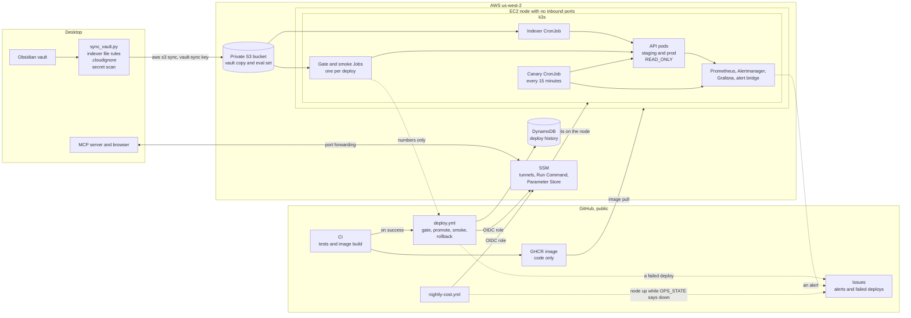

# Ops architecture

How the pieces in [PLAN.md](PLAN.md) fit together, and where the private vault can and cannot go. Everything through week 5 is written; the table at the end says what has actually run on a node and what has only been built. What it costs is in [cost.md](cost.md).

## The system

## Where the data lives

| Data | Lives in | Never reaches |
|---|---|---|
| Vault notes | The desktop, the private bucket, the node's encrypted volume | GitHub, GHCR, CI logs, alert emails |
| Notes the scan refuses or `.cloudignore` names | The desktop | Anywhere else |
| Private eval set | The desktop, the private bucket, the gate and canary Jobs | CI logs. Only counts and rates leave the cluster, and `output_guard.py` checks each line before the pipeline prints it |
| Container image | GHCR, public | Vault data. `.dockerignore` and the Dockerfile's named `COPY` lines keep it to code |
| Deploy history | DynamoDB | Anything beyond the SHA, the namespace, the outcome and the numbers `record_deploy.py` knows by name |
| Terraform state | The versioned state bucket | Vault content and access keys |
| Uploader key | The `vault-sync` profile in `~/.aws/credentials` on the desktop | Terraform state, the repo, chat logs |
| Grafana admin password | SSM Parameter Store | The repo |

## Who can reach what

| From | To | How |
|---|---|---|
| The internet | The node | Nothing. The security group has no inbound rules |
| The owner | The API and Grafana | SSM Session Manager port forwarding |
| GitHub Actions on `main` | AWS | The Terraform apply role, which trusts only this repo's `main` branch. The deploy role, trusted for the `staging` and `prod` environments only, which is why both environments are restricted to `main`. The cost role, trusted for `main`, reads whether a node is running and the month-to-date bill |
| Pull requests | AWS | A read-only role for Terraform plans. Forks get no OIDC token |
| The desktop | The vault bucket | The `second-brain-vault-sync` user, with list, put, and delete on that bucket only |
| The node | The vault bucket and SSM parameters | Its instance role, read only |
| Pods | The API | NetworkPolicies allow the same namespace and Prometheus |

## Nightly flow

1. The desktop's nightly job finishes.
2. `sync_vault.py` takes the indexer's file list and drops cloud-only placeholders, `.cloudignore` entries, and every file the secret scan matches. It mirrors the rest into a local staging folder and runs `aws s3 sync --delete`, so a note that becomes refused also leaves the bucket.
3. The indexer CronJob pulls the bucket into the node's volume and runs `rebuild_rag_index.py` while the API keeps serving. The API sees the write stamp move and reopens the store, the fix from PR #25. What happens when that fails is [postmortem-stale-index.md](postmortem-stale-index.md).

## Deploy flow

A merge to main that touches `backend/`, `deploy/k8s/`, `deploy/eval/` or `deploy/pipeline/` runs `deploy.yml` once CI has published the image for that commit: staging, the eval gate against the recorded card, prod, the smoke Job, and a rollback if any of it fails. Every cluster step is one script sent over SSM Run Command, and `output_guard.py` checks what the node printed before printing any of it, because a public workflow log cannot be taken back. The detail is in [PLAN.md section 6.4](PLAN.md#64-pipeline) and `deploy/pipeline/README.md`.

## When it breaks

Alerts and failed deploys arrive as GitHub issues on this repository; SNS email was dropped after its confirmation mail never arrived three times. `deploy/runbooks/` has one page per failure, `deploy/gameday/` has the four scripted failures that exercise them, and `nightly-cost.yml` catches the one mistake that is expensive: a node still running while `OPS_STATE` says it should be gone.

## Build status

| Piece | Status |
|---|---|
| Vault sync and secret scan, `deploy/sync/` | Built in week 0. The dry run on the real vault kept 2 of 718 files home. First upload 2026-09-17: 775 files plus the eval set, 2 kept home |
| Terraform, `deploy/terraform/`, and `deploy/ops.py` | Built in week 1 and applied 2026-09-12 with the node off. CI plans pull requests and applies on main since 2026-09-18 (#39) |
| App changes: `READ_ONLY`, metrics, JSON logs, HTTP eval, image contents, GHCR publish | Built in week 2, running on staging since 2026-09-19 |
| Kubernetes manifests, `deploy/k8s/` | Built in week 2. Staging answers queries through the SSM tunnel; requests and limits set from measured use |
| Monitoring and alerts | Built in week 3 and running on the node since 2026-09-19. Alerts become GitHub issues; the canary scores ten eval questions every 15 minutes |
| Deploy pipeline and eval gate, `deploy/pipeline/` and `.github/workflows/deploy.yml` | Built in week 4, not yet run on a node. Staging, the gate, promote, the smoke Job, rollback on failure, and a DynamoDB item per deploy, every cluster step sent over SSM |
| Game day, `deploy/gameday/` and `deploy/runbooks/` | Written in week 5, not yet run. Four scripted failures with their runbooks, and the postmortem for the incident scenario 3 replays |
