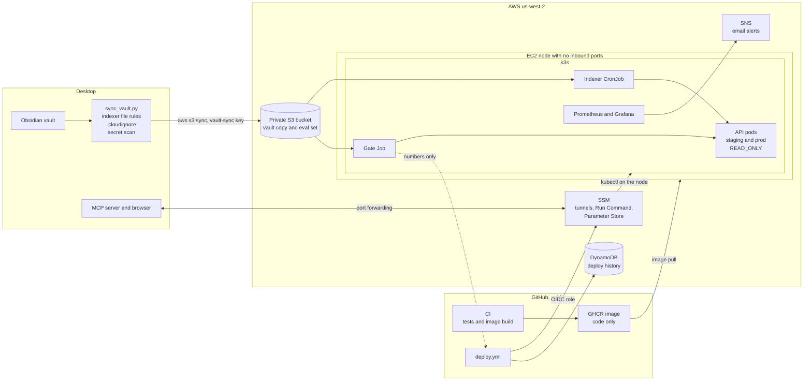

# Ops architecture

How the pieces in [PLAN.md](PLAN.md) fit together, and where the private vault can and cannot go. Most of this is planned. The table at the end says what exists today.

## The system

## Where the data lives

| Data | Lives in | Never reaches |
|---|---|---|
| Vault notes | The desktop, the private bucket, the node's encrypted volume | GitHub, GHCR, CI logs, alert emails |
| Notes the scan refuses or `.cloudignore` names | The desktop | Anywhere else |
| Private eval set | The desktop, the private bucket, the gate Job | CI logs. Only hit rate and latency leave the cluster |
| Container image | GHCR, public | Vault data. `.dockerignore` and the Dockerfile's named `COPY` lines keep it to code |
| Deploy history | DynamoDB | Anything beyond SHA, hit rate, p95 latency, and outcome |
| Terraform state | The versioned state bucket | Vault content and access keys |
| Uploader key | The `vault-sync` profile in `~/.aws/credentials` on the desktop | Terraform state, the repo, chat logs |
| Grafana admin password | SSM Parameter Store | The repo |

## Who can reach what

| From | To | How |
|---|---|---|
| The internet | The node | Nothing. The security group has no inbound rules |
| The owner | The API and Grafana | SSM Session Manager port forwarding |
| GitHub Actions on `main` | AWS | OIDC roles that trust only this repo's `main` branch and the `staging` and `prod` environments |
| Pull requests | AWS | A read-only role for Terraform plans. Forks get no OIDC token |
| The desktop | The vault bucket | The `second-brain-vault-sync` user, with list, put, and delete on that bucket only |
| The node | The vault bucket and SSM parameters | Its instance role, read only |
| Pods | The API | NetworkPolicies allow the same namespace and Prometheus |

## Nightly flow

1. The desktop's nightly job finishes.
2. `sync_vault.py` takes the indexer's file list and drops cloud-only placeholders, `.cloudignore` entries, and every file the secret scan matches. It mirrors the rest into a local staging folder and runs `aws s3 sync --delete`, so a note that becomes refused also leaves the bucket.
3. The indexer CronJob pulls the bucket into the node's volume and runs `rebuild_rag_index.py` while the API keeps serving. The API sees the write stamp move and reopens the store, the fix from PR #25.

The deploy flow is in [PLAN.md section 6.4](PLAN.md#64-pipeline).

## Build status

| Piece | Status |
|---|---|
| Vault sync and secret scan, `deploy/sync/` | Built in week 0. Dry run on the real vault pending |
| Terraform, `deploy/terraform/` | Week 1 |
| App changes: `READ_ONLY`, metrics, JSON logs, HTTP eval, image contents, GHCR publish | Week 2 |
| Kubernetes manifests, `deploy/k8s/` | Week 2 |
| Monitoring and alerts | Week 3 |
| Deploy pipeline and eval gate | Week 4 |
| Game day | Week 5 |
